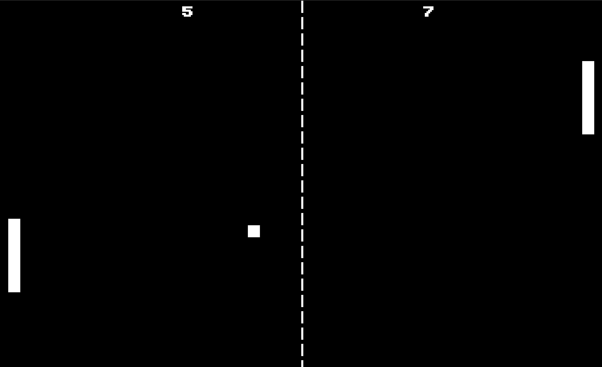
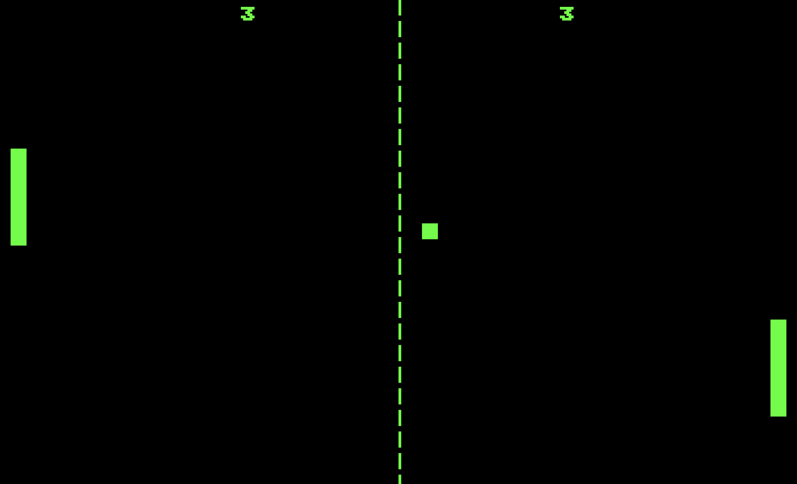
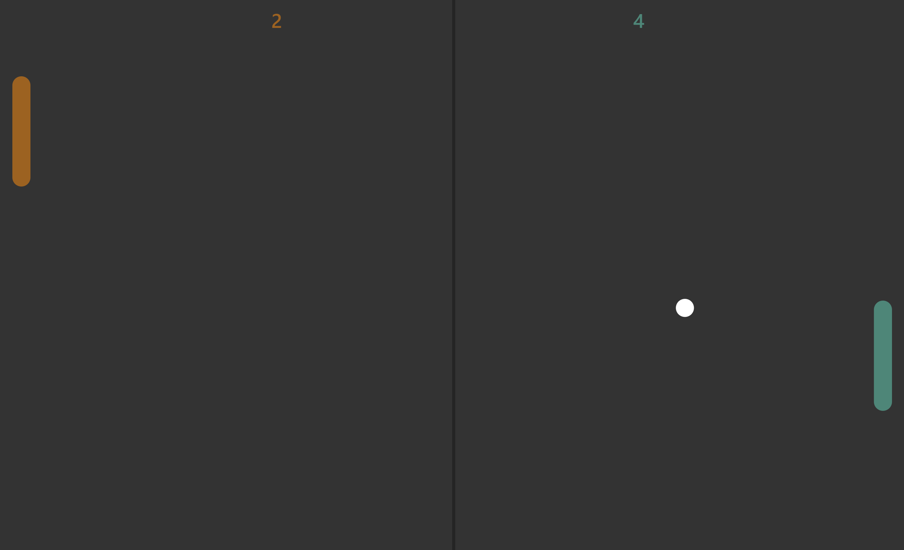
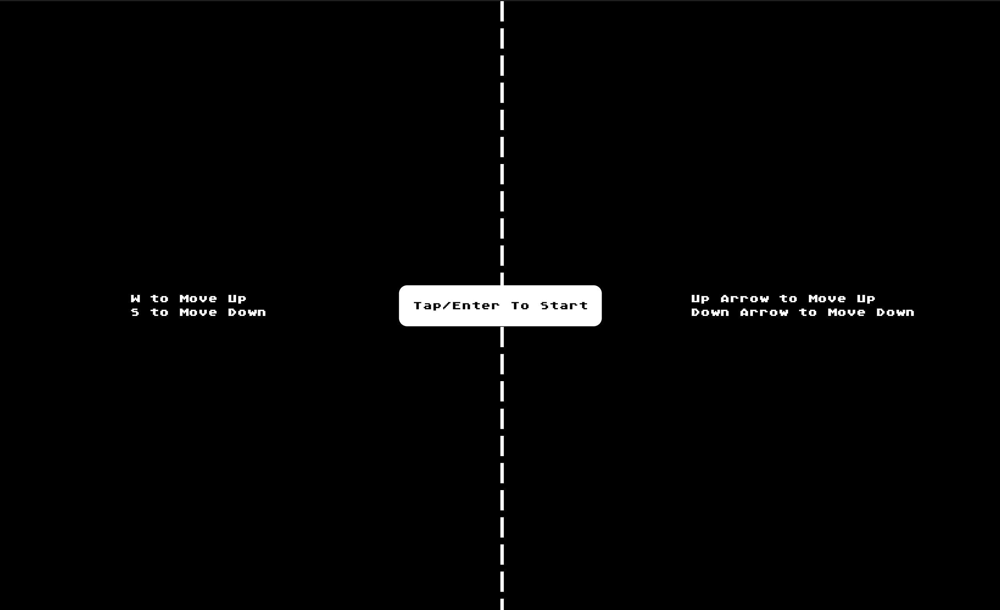
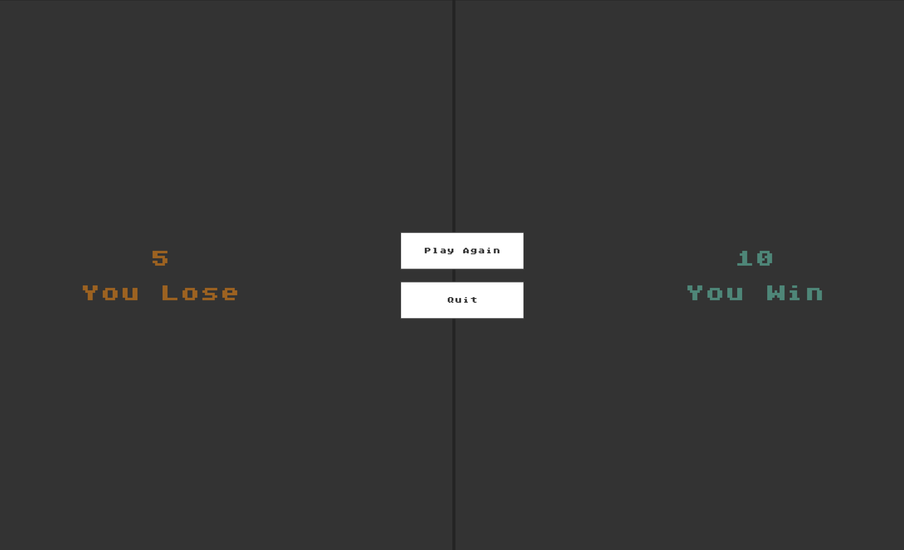

# 🕹️ Easy Pong

Welcome to Easy Pong, a classic Pong game built using Flutter and the Flame game engine! Easy Pong provides a smooth and engaging experience with modern UI and simple controls.

The Game Runs On All Platform (Android, Windows, Linux, Web, macOS and iOS)

If you like what you see, please ⭐ the repo.

## 📸 Screenshots

## ✨ Features

- 🧑‍🤝‍🧑 Ability to play Local Multiplayer (1v1)
- 🌐 1v1 LAN Multiplayer Mode
- 🎮 Play Against The Computer
- 🕹️ Supported By The Keyboard as well as the Joystick
- 🎨 Ability To Select From Multiple Different Themes (eq:- classic, football, matrix)
- 🔉 Built In Sound Effects

### 🔜 Upcoming Features
 - 🌍 Play Realtime Online Multiplayer Against a Friend

## 💻 Installation links

<table>
  <tr>
    <th>Platform</th>
    <th>Installation Links</th>
  </tr>
  <tr>
    <td>Android</td>
    <td>
    
       
      
    </td>
  </tr>
  <tr>
    <td>Windows</td>
    <td>
      
  </tr>
  <tr>
    <td>Website</td>
    <td>
      <a href="https://adeeteya.github.io/EasyPong/">
        Website Link
      </a>
  </tr>
  <tr>

</table>

## 🔌 Plugins

| Name                                                                  | Usage                                |
|-----------------------------------------------------------------------|--------------------------------------|
| [**flame**](https://pub.dev/packages/flame)                           | Game Engine Used to Develop the Game |
| [**flame_audio**](https://pub.dev/packages/flame_audio)               | To play game sound effects           |
| [**flutter_animate**](https://pub.dev/packages/flutter_animate)       | For Quick and Easy Animations        |
| [**flutter_riverpod**](https://pub.dev/packages/flutter_riverpod)     | For State Management                 |
| [**shared_preferences**](https://pub.dev/packages/shared_preferences) | To store system settings             |
| [**flutter_lints**](https://pub.dev/packages/flutter_lints)           | For linting                          |

## 🤓 Author

**[Aditya R](https://github.com/adeeteya)**

## 🔖 LICENCE
Copyright (c) 2024 Aditya R
[MIT LICENCE](https://github.com/adeeteya/EasyPong/blob/master/LICENSE)

## 🙏 Attributions
<a href="https://www.flaticon.com/free-icons/pong" title="pong icons">Pong icons created by Freepik - Flaticon</a>